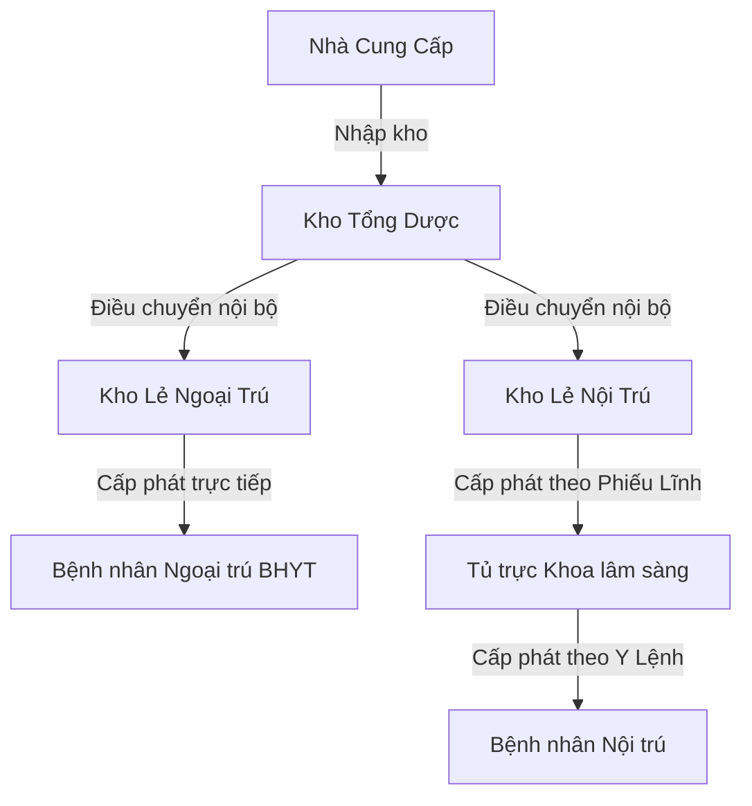

# HƯỚNG DẪN SỬ DỤNG HỆ THỐNG QUẢN LÝ DƯỢC BỆNH VIỆN
*(Hệ thống Quản lý cấp phát thuốc nội trú - ngoại trú bệnh viện tuyến cơ sở)*

Tài liệu này cung cấp danh sách tài khoản mẫu của các tác nhân, phân quyền hệ thống và hướng dẫn thực hiện các quy trình cốt lõi trong ứng dụng.

---

## 1. Danh sách tài khoản các tác nhân (Actors)

Tất cả các tài khoản dưới đây đều sử dụng mật khẩu mặc định là: **`123456`**

| Tên đăng nhập | Tác nhân / Vai trò | Họ tên | Kho / Khoa quản lý | Chức năng chính |
| :--- | :--- | :--- | :--- | :--- |
| **`ds.tong`** | **Dược sĩ Kho Tổng** (`duoc_si_tong`) | DS. Nguyễn Văn An | Kho Tổng Dược | Nhập kho nhà cung cấp, duyệt cấp phát điều chuyển cho kho lẻ, kiểm kê kho tổng. |
| **`ds.khole.ngoai`** | **Dược sĩ Kho Lẻ Ngoại Trú** (`duoc_si_kho_le`) | DS. Trần Thị Bình | Kho Lẻ Ngoại Trú | Lập phiếu dự trù thuốc, tiếp nhận thuốc điều chuyển, duyệt cấp phát đơn thuốc ngoại trú (BHYT). |
| **`ds.khole.noi`** | **Dược sĩ Kho Lẻ Nội Trú** (`duoc_si_kho_le`) | DS. Trần Thị Bình | Kho Lẻ Nội Trú | Lập phiếu dự trù thuốc, duyệt và cấp phát thuốc theo phiếu lĩnh nội trú của Điều dưỡng. |
| **`dd.noi`** | **Điều dưỡng Khoa Nội** (`dieu_duong`) | ĐD. Lê Thị Cúc | Khoa Nội (Tủ Trực) | Quản lý tủ trực khoa Nội, tạo phiếu lĩnh thuốc nội trú cho bệnh nhân, hoàn ứng thuốc dư. |
| **`dd.ngoai`** | **Điều dưỡng Khoa Ngoại** (`dieu_duong`) | ĐD. Nguyễn Thị Hoa | Khoa Ngoại (Tủ Trực) | Quản lý tủ trực khoa Ngoại, tạo phiếu lĩnh thuốc nội trú, hoàn ứng thuốc dư. |
| **`bs.nam`** | **Bác sĩ** (`bac_si`) | BS. Trần Văn Nam | Toàn viện | Khám bệnh, kê đơn thuốc ngoại trú, chỉ định y lệnh thuốc nội trú cho bệnh nhân. |
| **`kt.vien`** | **Kế toán viện** (`ke_toan`) | KT. Phạm Văn Dũng | Phòng Tài chính - Kế toán | Xem doanh thu, chi phí BHYT, quyết toán viện phí, xuất dữ liệu XML cổng giám định BHYT. |

---

## 2. Bản đồ phân hệ chức năng & Kho hàng

### Các loại kho trong hệ thống:
1. **Kho Tổng (Kho cấp 1):** Nơi tiếp nhận thuốc từ nhà cung cấp theo các gói thầu. Không trực tiếp cấp phát cho bệnh nhân.
2. **Kho Lẻ (Kho cấp 2):** Tiếp nhận thuốc điều chuyển từ Kho Tổng.
   * *Kho lẻ ngoại trú:* Cấp phát trực tiếp cho bệnh nhân lĩnh đơn thuốc BHYT ra viện.
   * *Kho lẻ nội trú:* Cấp phát thuốc theo lô (phiếu lĩnh) cho các tủ trực khoa phòng.
3. **Tủ Trực Khoa Lâm Sàng (Kho cấp 3):** Lưu trữ thuốc khẩn cấp, tủ trực hành chính tại các khoa điều trị. Cấp phát trực tiếp cho bệnh nhân nằm viện theo y lệnh hàng ngày.

---

## 3. Hướng dẫn các quy trình cốt lõi

### Quy trình 1: Nhập kho Dược phẩm (Kho Tổng)
* **Tác nhân thực hiện:** Dược sĩ Kho Tổng (`ds.tong`).
* **Các bước thực hiện:**
  1. Vào menu **Nhập kho** -> Chọn **Tạo phiếu nhập**.
  2. Chọn Nhà cung cấp, nhập số hóa đơn, ghi chú.
  3. Chọn thuốc, nhập số lô, hạn dùng (HSD), giá nhập và số lượng.
  4. Bấm **Lưu phiếu nhập**. Thuốc sẽ được nhập vào tồn kho của **Kho Tổng Dược**.

### Quy trình 2: Dự trù & Điều chuyển nội bộ (Giữa Kho Lẻ và Kho Tổng)
* **Tác nhân thực hiện:** Dược sĩ Kho Lẻ (`ds.khole.ngoai` / `ds.khole.noi`) & Dược sĩ Kho Tổng (`ds.tong`).
* **Các bước thực hiện:**
  1. **Yêu cầu (Kho Lẻ):** Đăng nhập Kho Lẻ -> Vào menu **Điều chuyển** -> Chọn **Tạo phiếu dự trù**. Lựa chọn thuốc cần và số lượng yêu cầu, sau đó gửi dự trù lên Kho Tổng.
  2. **Phê duyệt & Xuất (Kho Tổng):** Đăng nhập Kho Tổng -> Vào **Điều chuyển** -> Tìm phiếu đang ở trạng thái *Chờ duyệt* -> Nhấn **Duyệt**. Tại đây Kho Tổng có thể điều chỉnh số lượng thực xuất dựa vào tồn kho thực tế của Kho Tổng (áp dụng cơ chế xuất kho FEFO - Hết hạn trước xuất trước). Nhấn **Xác nhận duyệt xuất** để chuyển trạng thái sang *Đang vận chuyển*.
  3. **Nhận hàng (Kho Lẻ):** Đăng nhập Kho Lẻ -> Vào **Điều chuyển** -> Tìm phiếu đang *Đang vận chuyển* -> Nhấn **Xác nhận nhận**. Tồn kho của Kho Lẻ sẽ tự động được cộng thêm đúng số lượng thực nhận.

### Quy trình 3: Cấp phát thuốc Ngoại trú (BHYT)
* **Tác nhân thực hiện:** Dược sĩ Kho Lẻ Ngoại Trú (`ds.khole.ngoai`).
* **Các bước thực hiện:**
  1. Vào menu **Cấp phát Ngoại trú**.
  2. Danh sách các đơn thuốc ngoại trú do Bác sĩ kê mới nhất sẽ xuất hiện ở trạng thái *Mới/Chờ cấp phát*.
  3. Nhấp vào đơn thuốc để xem chi tiết. Hệ thống sẽ tự động gợi ý phân bổ lô thuốc theo nguyên tắc **FEFO** (lô hạn dùng gần nhất sẽ ưu tiên xuất trước).
  4. Nhấn **Xác nhận cấp phát**. Hệ thống sẽ trừ kho lẻ ngoại trú, đồng thời tính toán chi phí BHYT chi trả (ví dụ: 80% hoặc 100% tuỳ đối tượng BHYT) và phần bệnh nhân cùng chi trả.

### Quy trình 4: Cấp phát thuốc Nội trú (Theo phiếu lĩnh khoa phòng)
* **Tác nhân thực hiện:** Điều dưỡng khoa lâm sàng (`dd.noi` / `dd.ngoai`) & Dược sĩ Kho Lẻ Nội Trú (`ds.khole.noi`).
* **Các bước thực hiện:**
  1. **Lập phiếu lĩnh (Điều dưỡng):** Vào menu **Y lệnh & Phiếu lĩnh** -> Chọn các y lệnh bác sĩ chỉ định chưa lĩnh -> Bấm **Tạo phiếu lĩnh** gửi khoa Dược.
  2. **Cấp phát thuốc (Dược sĩ Kho Lẻ Nội Trú):** Đăng nhập `ds.khole.noi` -> Vào menu **Cấp phát Nội trú** -> Chọn phiếu lĩnh đang chờ xử lý -> Nhấn **Xem & Cấp phát**. Hệ thống tự động kiểm tra tồn kho và gợi ý lô FEFO. Bấm **Xác nhận cấp phát**.
  3. **Ghi nhận chi phí:** Chi phí thuốc sẽ tự động phân bổ vào hồ sơ bệnh án nội trú của bệnh nhân phục vụ việc quyết toán viện phí lúc ra viện.

### Quy trình 5: Quyết toán viện phí & Xuất XML cổng BHYT
* **Tác nhân thực hiện:** Kế toán viện (`kt.vien`).
* **Các bước thực hiện:**
  1. Vào menu **Quyết toán viện phí** -> Tìm bệnh nhân ra viện cần quyết toán.
  2. Hệ thống tổng hợp toàn bộ chi phí thuốc nội trú/ngoại trú đã sử dụng, phân tách rõ tiền BHYT thanh toán và tiền Bệnh nhân trả.
  3. Bấm **Xác nhận quyết toán**.
  4. Vào menu **Xuất dữ liệu BHYT (XML QĐ 130)** -> Chọn đợt điều trị của bệnh nhân đã hoàn thành quyết toán -> Bấm **Xuất file XML** (Hệ thống sẽ tạo ra tệp tin XML đúng cấu trúc chuẩn dữ liệu giám định của Bộ Y tế).

---

## 4. Các Quy tắc Nghiệp vụ Đặc thù (Business Rules)
* **Quy tắc FEFO (First Expired, First Out):** Khi xuất thuốc (cấp phát hoặc điều chuyển), hệ thống luôn tự động quét các lô thuốc của mặt hàng đó và ưu tiên xuất lô có hạn dùng gần nhất.
* **Quy tắc chặn khi đang Kiểm kê:** Khi một kho bất kỳ đang thực hiện quy trình kiểm kê định kỳ (trạng thái kho: `dang_kiem_ke`), hệ thống sẽ khóa toàn bộ tính năng liên quan đến thay đổi số lượng tồn kho (nhập, xuất, cấp phát, điều chuyển) liên quan đến kho đó để tránh sai lệch dữ liệu.
* **Tính toán chi phí BHYT:** Áp dụng theo quy định hiện hành bao gồm tỷ lệ thanh toán của đầu mục thuốc trong danh mục BHYT kết hợp mức hưởng trên thẻ BHYT của người bệnh (100%, 95%, 80%).

---
*Chúc bạn vận hành hệ thống hiệu quả!*
